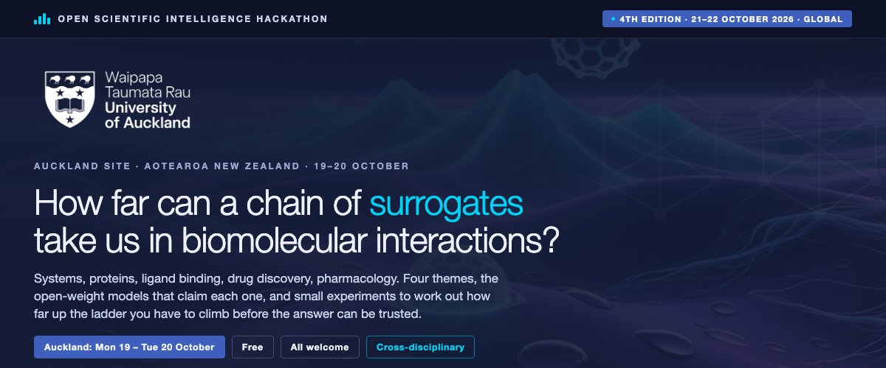
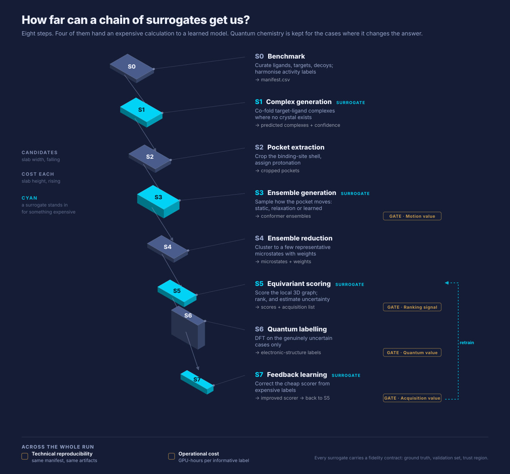
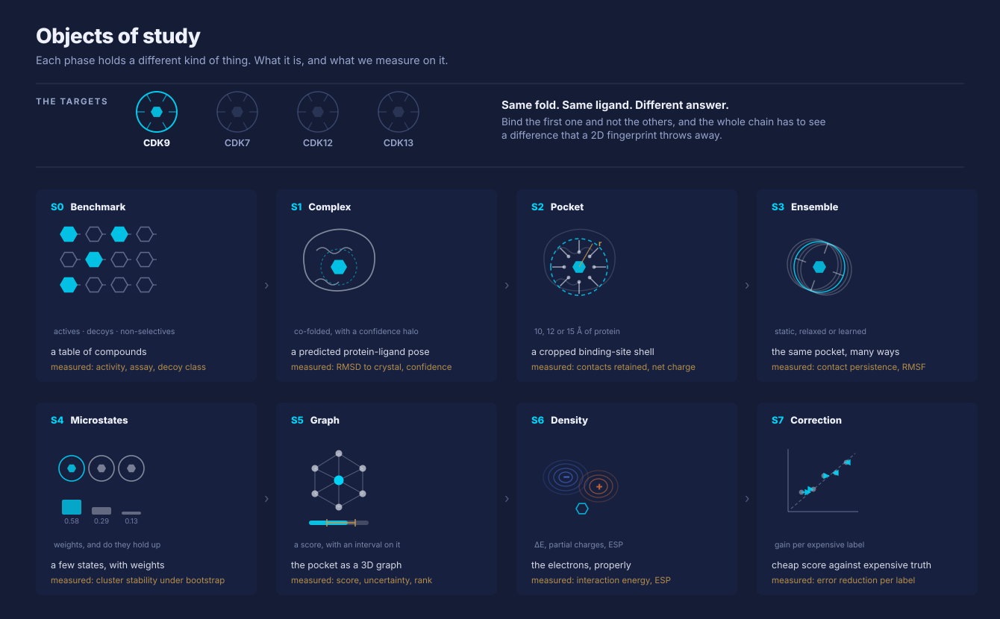
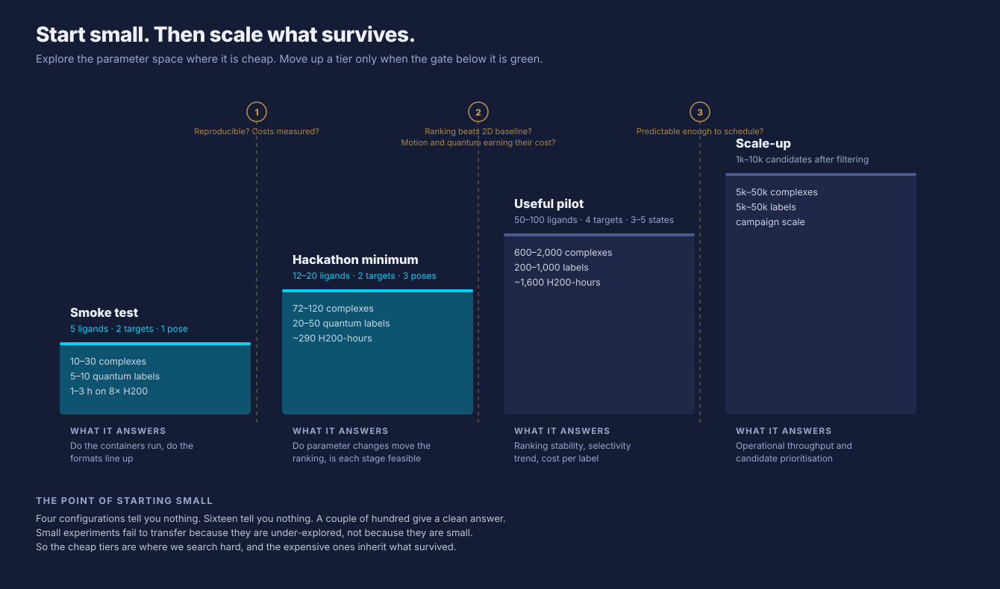

<br>


<br>

## How far can a chain of surrogates get us?

**Three things, in order.**

**1. Hand every expensive step to a learned surrogate.**
Individual steps have been done well by other groups.
We haven't found anyone who ran the whole chain.

**2. Measure where that lands, as a baseline.**
It might not be good enough yet. We'd still like the number.
Every step is improving quickly. At some point the chain crosses a threshold.
Without a starting point we won't know when.

**3. Get there by starting small.**
Twelve compounds. Two targets. A handful of quantum labels.
Explore the parameter space properly at that size.
Scale only what survives.

📖 **[Read the narrative](docs/00-event/narrative.md)**, about ten minutes.

> ### 🌏 The global event
> We're one local site of the **Open Scientific Intelligence Hackathon**. Fourth year, hubs on four
> continents, over a thousand participants last year, and a write-up each year crediting every team.
>
> **It runs 21–22 October and [registration is open to anyone](https://luma.com/ku88xh92).** Sign up
> for that whether or not you come to ours. Auckland runs 19–20 October, which are the two days we
> have, and Wednesday the 21st is open if people want to carry the work across.
>
> [llmhackathon.github.io](https://llmhackathon.github.io/) · [how we fit in](docs/00-event/the-global-event.md)

<br>


<br>

## The chain

Eight steps. Each cheap enough to run on everything reaching it. Each allowed to be wrong in a
characterised way that the next step corrects.



Four steps hand an expensive calculation to a learned model.

A surrogate can be fast, confident and wrong. It can be accurate on average and wrong on the close
calls the pipeline exists to resolve. So each declares where it can be trusted, which is what the
[fidelity contracts](docs/03-pipeline/fidelity-contracts.md) are for.

<br>


<br>

## What each phase actually holds

Different matter at every step. A table of compounds. A predicted pose. A cropped shell. An
ensemble. A few weighted states. A graph. An electron density. A correction.



The testbed is **CDK9 against CDK7**. Same fold, same ligand, different answer.

<br>


<br>

## The protein space we're in

All four targets have deposited structures at decent resolution. Superposed onto CDK9 and drawn
through one camera, so what differs between panels is the protein, not the pose.


Same fold, same place, ligand in the same cleft. That is the problem in one picture.


Whole-domain identity understates the problem. CDK9 against its counter-targets is 44–50% identical
over the kinase region, but **67–72% across the ATP site**.

And a harder pair sits in the same family. **CDK8 and CDK19 are identical at all 18 pocket
positions.** CDK4 and CDK6 are at 94%. Natural scale-up targets once the chain holds on ours.

Numbers from [`tools/fetch_protein_space.py`](tools/fetch_protein_space.py) into
[`data/protein-space.json`](data/protein-space.json), so they regenerate and can be checked. Site
positions there are mapped from CDK2 by sequence alignment, so treat them as indicative — the
figure below does it properly, by superposition.

### Zoom in and it comes down to one residue

Twenty residues line the CDK9 site within 5 Å of the ligand. Across those twenty, **two** are
positions where CDK9 differs from all three counter-targets.


**Cys106 sits at the hinge. CDK7, CDK12 and CDK13 all have methionine there.** It is 3.2 Å from
flavopiridol. Equivalence is by structural superposition, not sequence alignment.

That is the discrimination problem stated exactly: not "these proteins are similar" but *this atom,
here, is the difference*.

### Every stage works at a different scale


Same structure, same camera. Only the radius changes. Bright is kept, dim is discarded, and the
heavy-atom count under each panel is what that stage pays.

Between a 4 Å region and a 15 Å crop the quantum cost moves by **more than two orders of
magnitude**, and nobody has told us where the accuracy stops improving. That is the reason
`s2.crop_radius_A` is swept rather than chosen.

🔬 **[Open the structures](tools/render/viewer.html)** in a browser: all four rotatable, plus a
superposed view, with the crop radius as a button. GitHub can't run the viewer inline, so the SVGs
above are the static version. Both come from the same PDB entries.
More in [visualisation.md](docs/03-pipeline/visualisation.md).

<br>


<br>

## Start small, then scale

The pipeline has about eight configurable choices. Each combination costs GPU hours. Nobody can
explore that at production scale, so the usual approach is to guess most of it and tune a couple of
knobs on a small grid.

Recent work says that's the mistake. Small experiments fail to transfer because they're
under-explored, not because they're small. Four configurations showed nothing. Sixteen showed
nothing. 256 gave a clean answer.



Four tiers, and each gate has to be green before we move up. The hackathon sits at tier two.

What we want answered: is this even feasible, what data would we need, and how small can we go
while still being usefully robust.

Not chemistry-specific. Anyone with one field season, a small cohort or a three-week synthesis has
the same problem. [More on the method](docs/04-experiments/hpo-microtopic.md).

<br>


<br>

## New here? Pick a ladder

You shouldn't have to read this repo to be useful in it. Six pathways, each a set of rungs you climb
in order. Each rung is small enough to finish in a sitting, and you can stop at any of them.

| | Ladder | For you if… | Rung 1 is |
| --- | --- | --- | --- |
| **A** | [New to AI for science](docs/00-event/onboarding/newcomer.md) | You're expert in something else and haven't done this | Running one configuration, your name on the dashboard |
| **B** | [Domain expert](docs/00-event/onboarding/domain-expert.md) | Chemistry, pharmacology, structural biology | Judging five predicted poses |
| **C** | [ML and statistics](docs/00-event/onboarding/ml-stats.md) | You model things, and the method is the draw | Telling us where our small-data design breaks |
| **D** | [Builder](docs/00-event/onboarding/builder.md) | RSE, HPC, or you want to write the pipeline | `make smoke` green on your machine |
| **E** | [Following along](docs/00-event/onboarding/follower.md) | Can't commit, but want to know how it goes | Subscribing to the live log |
| **F** | [Stage owner](docs/00-event/onboarding/stage-owner.md) | You've said yes to a work package | Filing three questions about your stage |

Not sure, start at [Ladder A rung 0](docs/00-event/onboarding/newcomer.md#rung-0--orient-10-minutes).
Ten minutes, and it'll point you somewhere better if you're in the wrong place.

**New to AI for science?** Within the first hour you'll own one configuration of the pipeline. One
command, twenty minutes, and your run becomes a data point in the final analysis. Bring a laptop,
that's all.

### Following without joining

We keep a [live event log](EVENT-LOG.md) as a single pull request that stays open until the final
presentations and reports are done. Subscribe and you'll get every update and nothing else.

<br>


<br>

## The global event

We're a local site for the [Open Scientific Intelligence Hackathon](docs/00-event/the-global-event.md),
now in its fourth year, with hubs on four continents and over a thousand participants last year.

**The global event runs 21-22 October and [registration is open to anyone](https://luma.com/ku88xh92).**
If you're interested in this space at all, sign up for that whether or not you come to ours. We're
running 19-20 October because those are the two days we have. Wednesday the 21st is open if people
want to keep going, and it's the global event's opening day, so that's a straightforward way to
carry the work across.

<br>


<br>

## How the work is tracked

Six phases run in parallel, so issues carry two axes.

**Work package**, which is who owns it: `wp:A-benchmark` · `wp:B-structure` · `wp:C-ensembles` ·
`wp:D-scoring` · `wp:E-quantum` · `wp:F-workflow` · `wp:methodology`. Maps to
[work-packages.md](docs/05-delivery/work-packages.md).

**Milestone**, which is when: W1 unblock (25 Sep) · W2 skeleton (2 Oct) · W3 make it real (9 Oct) ·
W4 rehearse (16 Oct) · Event (20 Oct). These are the weekly gates from the
[critical path](docs/05-delivery/critical-path.md).

[Issues by milestone](https://github.com/drai-inn/drugs-surrogate-pipeline/milestones) ·
[open issues](https://github.com/drai-inn/drugs-surrogate-pipeline/issues)

**B, C and D currently have no issues**, which is the same gap as the unnamed owners, just visible.

## Where things are

| | |
| --- | --- |
| Doing something this week | [Critical path](docs/05-delivery/critical-path.md) · [open issues](https://github.com/drai-inn/drugs-surrogate-pipeline/issues) |
| Inviting someone | [`outreach/`](outreach/), one-pager, templates, poster, [brand](outreach/brand/README.md) |
| The science | [Problem statement](docs/01-context/problem-statement.md) → [Architecture](docs/03-pipeline/architecture.md) → [Stages](docs/03-pipeline/stages/) |
| Structures and figures | [Visualisation](docs/03-pipeline/visualisation.md) · [render scripts](tools/render/) · [figures](docs/03-pipeline/figures/) |
| The method | [Small-data HPO](docs/04-experiments/hpo-microtopic.md) · [Methodology](docs/04-experiments/methodology.md) · [Metrics](docs/04-experiments/metrics.md) |
| Compute | [GB10 / H200 plan](docs/06-feasibility/compute-plan.md) · [Budget](docs/06-feasibility/compute-budget.md) |
| What's undecided | [Open questions](docs/02-scope/open-questions.md) · [Risks](docs/06-feasibility/risks.md) |
| Who to talk to elsewhere | [Interested parties](docs/00-event/interested-parties.md) |
| How we work | [CONTRIBUTING.md](CONTRIBUTING.md) · [Glossary](docs/02-scope/glossary.md) |

```
docs/
  00-event/       narrative, the global event, engagement, onboarding ladders,
                  who to reach out to                         OUTWARD-FACING
  01-context/     why this problem; notes on the source documents
  02-scope/       in, out, undecided, glossary
  03-pipeline/    S0–S8 stages, fidelity contracts, data contracts, figures
  04-experiments/ methodology, parameter space, metrics, the HPO microtopic
  05-delivery/    critical path, plan, work packages, roles   INWARD-FACING
  06-feasibility/ compute, budget, data sources, risks, gates
  adr/            decision records
outreach/         collateral, brand tokens, marks, UoA assets
schemas/ data/ tools/ workflow/ refs/
```

## Try it now

Standard library only, nothing to install:

```bash
make validate && make budget TIER=hackathon_minimum
python3 tools/make_figures.py            # the four schematic figures
python3 tools/render_structures.py       # the CDK backbones, from real coordinates
python3 tools/fetch_protein_space.py     # refresh the CDK family numbers, needs biopython
open tools/render/viewer.html            # CDK9 and CDK7, rotatable
```

<br>


<br>

A clean "no" is a good outcome. Six gates were written before any data existed, and if the chain
doesn't hold we'd rather know in two days than two years.

Nick Jones · njon001@aucklanduni.ac.nz ·
[Global event](https://llmhackathon.github.io/) · [Live log](EVENT-LOG.md) · [Contributing](CONTRIBUTING.md)
