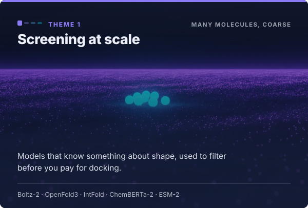
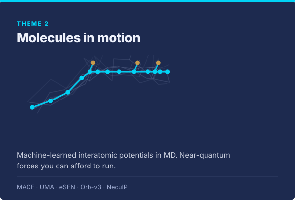
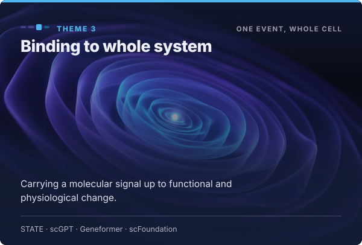
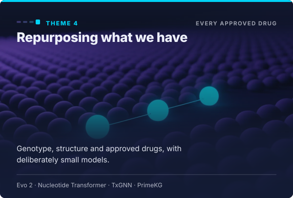
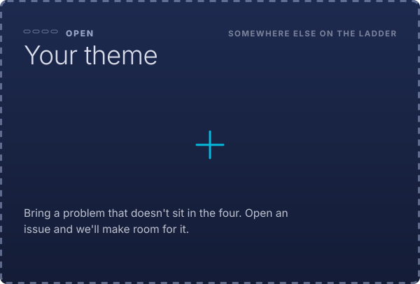
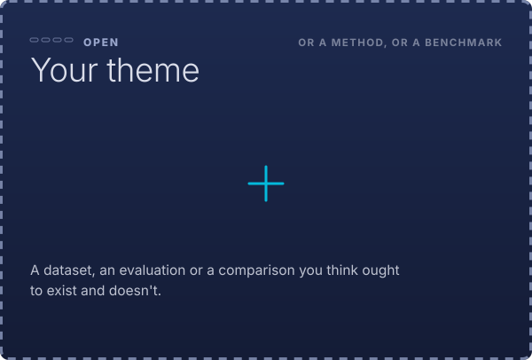

 

 

## How far can a chain of surrogates take us in biomolecular interactions?

**Systems · proteins · ligand binding · drug discovery · pharmacology**

Physiological outcomes come from molecules interacting. Those interactions produce functional
change. Function is driven by spatial and structural change. Pharmacology is the effect of drugs on
that system.

Biology has a ladder of scales, and machine learning now has one running alongside it. Association
models over sequence, 3D-aware models over structure, interatomic potentials over atoms and motion,
multi-scale models over cells and tissue. **Language models sit at nearly every rung too** — over
protein sequence, over DNA, over molecules written as text, over gene expression, and over the
literature itself. Most are open-weight and most arrived recently.

Two days to find out how far up that second ladder you have to climb to get an answer you can trust.

🌐 **[drai-inn.github.io/osi-hackathon-auckland](https://drai-inn.github.io/osi-hackathon-auckland/)** — the public page, and where to send anyone

📖 **[The pitch](docs/narrative.md)** · 🧭 **[The themes](docs/themes.md)** · 🙋 **[Taking part](docs/taking-part.md)**

> ### 🌏 The global event, which is why any of this is happening
>
> The **Open Scientific Intelligence Hackathon** is in its fourth year. It began as the LLM
> Hackathon for Materials Science and Chemistry and has widened to the physical sciences and
> mathematics. Free, hybrid, and run from sites around the world on the same two days.
>
> **120** projects submitted in 2025 · **16** on-site locations plus virtual · **4** community
> papers, every team credited · **free**, and one registration covers every site.
>
> **Auckland runs Mon 19 – Tue 20 October; the global days are 21–22 October.** Registering once
> covers both, and Wednesday the 21st is open if a group wants to carry the work across. Every
> edition is written up with every contributor named, which for two days' work is a real line on
> a CV.
>
> **[Register — free](https://luma.com/ku88xh92)** ·
> [llmhackathon.github.io](https://llmhackathon.github.io/) ·
> [their Slack](https://join.slack.com/t/llmsformateri-0lw8517/shared_invite/zt-3df7bc0z5-I6odHw8eHaBbtHqsGxqz0Q) ·
> [how we fit in](docs/the-global-event.md)

### Built at past editions, close to our themes

All open source, all from the 2025 event. Worth half an hour before October — it's the fastest way
to see what two days actually produces, and several are live starting points rather than sketches.

**Near theme 1, screening at scale**

- **[MIDAS](https://github.com/pagel-s/MIDAS)** — agentic structure-based drug design, steering
  DiffSBDD inside a pocket and analysing the poses it gets back. *Glasgow*
- **[SmeLLMap](https://github.com/Justice-Lu/spatialESM_OdorClassification)** — ESM-2 over
  receptors with voxelised binding cavities: a different answer to representing a pocket. *Duke*

**Near theme 2, molecules in motion**

- **[UMADock](https://github.com/MauricioCafiero/UMADock)** — docking with an MLIP as the scoring
  function, with desolvation and ligand-strain terms. *CafChem*
- **[DynaMate](https://github.com/schwallergroup/DynaMate)** — autonomous protein–ligand MD over
  GROMACS and AMBER with MM/PB(GB)SA, retrying when a step fails. Began at the hackathon as
  DynaAgent and still being developed ([preprint](https://arxiv.org/abs/2512.10034)). *EPFL, LIAC*
- **[LARA-HPC](https://github.com/BigDFT-group/llm-hackathon-2025)** — an agent submitting
  electronic-structure workflows to a cluster, with a rehearsal mode that validates first.
  *CEA, CNR, INRIA, RIKEN and others*
- **[DFTPilot](https://github.com/chiku-parida/DFTPilot)** — retrieval plus crystal GNNs to set up
  and preview a DFT calculation before you pay for it. *DTU, UCL, Cambridge, NTU*

**Near themes 3 and 4** — thin, which is the interesting part. Nothing in 2025 carried a molecular
signal up to cells or physiology, and nothing took on drug repurposing directly.
**[AssemblAI](https://github.com/ndharms/peptide-agent)** (peptide self-assembly protocols) and
**[ARIA](https://github.com/yicao-elina/LLM4Chem-Explainable-synthesis)** (causal knowledge graphs
for inverse design) are the nearest.

**Useful whatever you work on** —
**[ACME](https://github.com/HassanHarb92/ACME)** literature to structured data ·
**[AtomBridge](https://github.com/dpalmer-anl/AtomBridge)** papers to validated structures ·
**[ATOMS Lab](https://github.com/ahaibel/mp-property-analogies)** property prediction on 50–300
examples · **[MCP4SDL](https://github.com/ivoryzh/MCP4SDL)** MCP interfaces to lab instruments.

**[The full picture](docs/the-global-event.md)**, including where the gaps are.

 

 

## Themes

Four to start from. They describe the kind of work we're interested in, and they come from where we
happen to sit. Bring your problem and take a space. If none of them fit, add one — we're making room
for people to gather, and the shape of the room is still open.

**And the wider scope.** The global event takes submissions across the physical sciences and
mathematics, in any of: **autonomous agents · language models · datasets · benchmarks · models ·
scientific software.** Anything in that scope works here. A benchmark nobody has built, a dataset
that should exist, a piece of software your field keeps rewriting, an agent that does a job you
currently do by hand — all of it counts, and none of it has to be about ligands.

The two dotted tiles are real. **[Propose a theme](https://github.com/drai-inn/osi-hackathon-auckland/issues/new?title=Theme%3A%20&amp;body=Four%20themes%20are%20up%20on%20the%20site.%20This%20one%20is%20somewhere%20else.%0A%0A%2A%2AThe%20problem%2C%20and%20roughly%20what%20scale%20it%20sits%20at%2A%2A%0A%0A%0A%2A%2AModels%20or%20methods%20you%27d%20want%20to%20try%2A%2A%0A%0A%0A%2A%2AWho%27s%20coming%20with%20you%2A%2A%0A)** and we'll make space for it.

In each of them, the same three moves: **find out what open-weight models exist in your area · get one
or two running on our hardware · work out what to measure, and report it back.**

That third move is the one we care most about. How to evaluate these models is genuinely unsettled.
A recent benchmark found single-cell foundation models level with a simple linear baseline, and
another found the choice of metric changes which model comes out on top. There's a lot of room to
do useful work there.

Each group sources its own data and picks its own benchmark. What makes the groups comparable is
that everyone answers [the same four questions](docs/taking-part.md#the-four-questions) about
whatever they picked, reported back at the end of day 1. Schema-guided extraction with an LLM is a
quick way to get a dataset together.

**Language models are in scope everywhere.** ESM and AMPLIFY over protein sequence, Evo 2 over DNA,
ChemBERTa over molecules as text, Geneformer and scGPT over gene expression, and physics-informed
frameworks that build and steer a simulation from a description. In several of these places they're
the thing to beat.

**[The themes in full](docs/themes.md)** · **[a worked example](docs/worked-example.md)** if you'd
rather start with something ready to go.

 

 

## Who it's for

**Come and explore the broader opportunity while getting hands-on with AI in your own area.** Come
prepared to work with agents and with code, to find out where your own methods are moving under the
new models.

The agent writes the code. You bring the judgement about whether the answer is any good. Everyone is
welcome here, whatever you last wrote and whenever you last wrote it.

We're inviting **project teams**. A group leader brings their team, their expertise, and a problem
or candidate. **If you can only come for the opening, come for the opening** and leave your team to
it. Coming on your own works too.

Chemists · physicists · structural biologists · statisticians · ML researchers · systems biologists ·
pharmacologists · clinicians · bioinformaticians · research software engineers · and anyone new to
all of it.

## The two days

**Day 1** — get running, do something, work out what to measure, report back. You can pick a
benchmark once you've seen a model behave, so that comes after the running.

**Day 2** — measure it, and report what you got, including the negatives.

Bookends each day, lightning talks each day, work in ones, twos and threes, and food and a social
occasion both days. Setup is agentic support plus our team, and we'll have at least one model per
theme known to run on our hardware before anyone arrives.

**[More on taking part](docs/taking-part.md)** · **[How we work](CONTRIBUTING.md)**

 

 

## Practical

| | |
| --- | --- |
| **When** | Mon 19 – Tue 20 October 2026. Wednesday 21st open if people want to keep going |
| **Where** | Digital Research Innovation & AI Lab, Level 10, 70 Symonds Street, University of Auckland |
| **Cost** | Free |
| **Bring** | A laptop |
| **Register** | Free, through the global event — [luma.com/ku88xh92](https://luma.com/ku88xh92) |
| **Questions** | [Open an issue](https://github.com/drai-inn/osi-hackathon-auckland/issues/new) |

We keep a [live event log](EVENT-LOG.md) as a single pull request that stays open until the final
presentations and reports are done. Subscribe and you'll get every update and nothing else.

## Where things are

| | |
| --- | --- |
| The pitch, and all copy cut from it | [narrative.md](docs/narrative.md) |
| The themes, and proposing one | [themes.md](docs/themes.md) |
| Coming along | [taking-part.md](docs/taking-part.md) · [the global event](docs/the-global-event.md) |
| Something ready to work on | [worked-example.md](docs/worked-example.md) · [figures](docs/figures/) |
| Compute | [compute.md](docs/compute.md) — two architectures, and what that means |
| The models behind the agents | [agentic-models.md](docs/agentic-models.md) — the open-weight shortlist, and what actually fits |
| Small experiments | [small-experiments.md](docs/small-experiments.md) — learning a parameter space when every run is expensive |
| Inviting someone | [`outreach/`](outreach/) · [brand](outreach/brand/README.md) |
| Who else is working on this | [interested-parties.md](docs/interested-parties.md) — past projects, with code |
| Decisions | [`docs/adr/`](docs/adr/) · [glossary](docs/glossary.md) |

 

 

We don't know how far this gets. Some of these models may land level with much simpler things on the
problems we care about, and we'd like the number either way. A well-founded *"not yet, and here's
why"* is a result we'd be happy to present.

**Licence.** Documentation, copy and imagery under [CC BY 4.0](LICENSE); code in `tools/` under MIT.
Brand marks and model weights are not covered — see [LICENSE](LICENSE).

**[drai-inn.github.io/osi-hackathon-auckland](https://drai-inn.github.io/osi-hackathon-auckland/)** ·
[Register](https://luma.com/ku88xh92) · [Global event](https://llmhackathon.github.io/) ·
[Live log](EVENT-LOG.md) · [Contributing](CONTRIBUTING.md)
