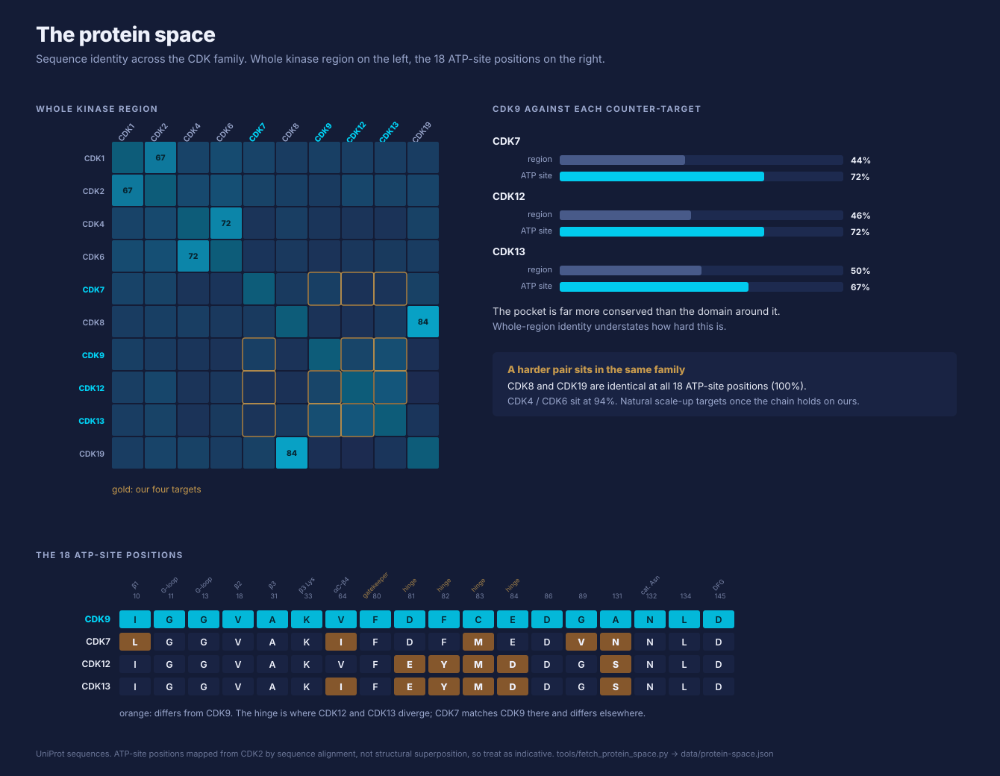

# Problem statement

## The scientific problem

Large-scale virtual screening is good at triage and bad at discrimination. 1D/2D methods
(fingerprints, QSAR, ligand-based similarity) can rank millions of compounds cheaply, but they
have weak pocket awareness. They answer *"does this chemotype bind somewhere?"* The question
that decides whether a programme survives is usually different:

> **Why would this compound bind *this* pocket and not a highly similar one?**

That question dominates in exactly the cases that matter most and where public data is thinnest:

- **Paralog selectivity** — CDK9 vs. CDK7/12/13, kinase families generally
- **Allosteric and cryptic pockets** — little or no co-crystal precedent
- **PROTAC-like and induced-proximity systems** — ternary geometry, linker conformation
- **Novel or underrepresented targets** — where the training distribution simply lacks examples

For these, the discriminating signal lives in **local 3D geometry, induced fit, electrostatics,
polarization and conformational ensembles** — none of which survive the projection down to a 2D
fingerprint. `[source-doc]`

The numbers are worth sitting with. CDK9 against its counter-targets is 44–50% identical over the
kinase region, and 67–72% across the ATP site. The pocket is where the conservation concentrates,
which is exactly the part that has to be told apart. And CDK8 / CDK19 are identical at all 18 site
positions, so the family contains a harder pair than ours.
See [visualisation.md](../03-pipeline/visualisation.md).

## Why now, and why this shape of solution

Three things have changed enough to make a different pipeline shape plausible:

1. **Open-weight 3D models are good enough to generate hypotheses.** Co-folding and complex
   prediction models (Boltz-2 class, Chai class) produce plausible holo geometries where no
   crystal structure exists. They are not truth, but they are a usable prior.
2. **Equivariant pocket scorers generalise via geometry.** Models that operate on a cropped
   binding-site graph (Nesso-1 class) transfer to unseen pockets far better than global
   descriptors, because geometry is the shared language.
3. **GPU quantum chemistry is now a practical labelling layer.** NVIDIA cuEST and similar make
   DFT-quality electronic-structure labels on pocket-sized systems tractable in batch — not for
   millions of compounds, but for the thousands where the answer is genuinely in doubt.
   `[source-doc]`

The opportunity is therefore **not a new model**. It is a **selectivity-focused, pocket-aware,
multi-fidelity workflow** in which open-weight 3D models provide speed and coverage, motion-aware
sampling adds realism, and quantum refinement supplies the chemistry signal that is otherwise
missing — spent deliberately, not sprayed. `[source-doc]`

## The methodological problem

There is a second, orthogonal problem, and it is the one that makes or breaks the hackathon.

A pipeline like this has a **large, mixed configuration space**: pocket crop radius, pose count,
dynamics mode, retained microstates, scorer capacity and graph cutoff, quantum theory level,
active-learning acquisition threshold. Each combination costs GPU-hours. Nobody can afford to
explore it at production scale. So the standard move is to guess most of it and tune two or three
knobs on a small grid.

[Lourie et al. (2026)](source-notes/small-scale-experiments.md) make a case, in the language
modelling setting, that this is precisely the failure mode: **thorough hyperparameter search is
the single ingredient that determines whether small-scale experiments transfer at all**, and
small scales are *more* sensitive than large ones, not less. With 4 or 16 configurations the
regularity they were looking for was invisible; at 256 it was accurate. `[literature]`

We should expect the same trap here, with the extra twist that our most important
"hyperparameters" are pipeline-structural (crop radius, ensemble size, acquisition policy)
rather than optimiser settings. See [hpo-microtopic.md](../04-experiments/hpo-microtopic.md) for
how far that analogy can honestly be pushed — it is a hypothesis to test, not a result to assume.

## What success looks like at this stage

Not a better binder. At this stage, success is **a defensible decision about whether to build
this thing at scale**, supported by:

- a shared, reusable benchmark on which every stage can be measured
- each pipeline stage understood well enough that its owner can state its cost, its failure
  modes, and the contract it owes downstream
- evidence about *which* configuration choices move selectivity ranking and which are noise
- one integrated end-to-end run, however small, that a third party could reproduce

See [success criteria and stage gates](../06-feasibility/stage-gates.md).

## What this is not

- Not a docking replacement, and not a claim to beat FEP on absolute affinity.
- Not a prospective discovery campaign. No compound will be ordered on the strength of the
  hackathon.
- Not a commitment to any specific model. Boltz-2, Nesso-1, MACE and cuEST are named because
  they are concrete, available, and fit the stage roles — each is swappable behind its interface.
