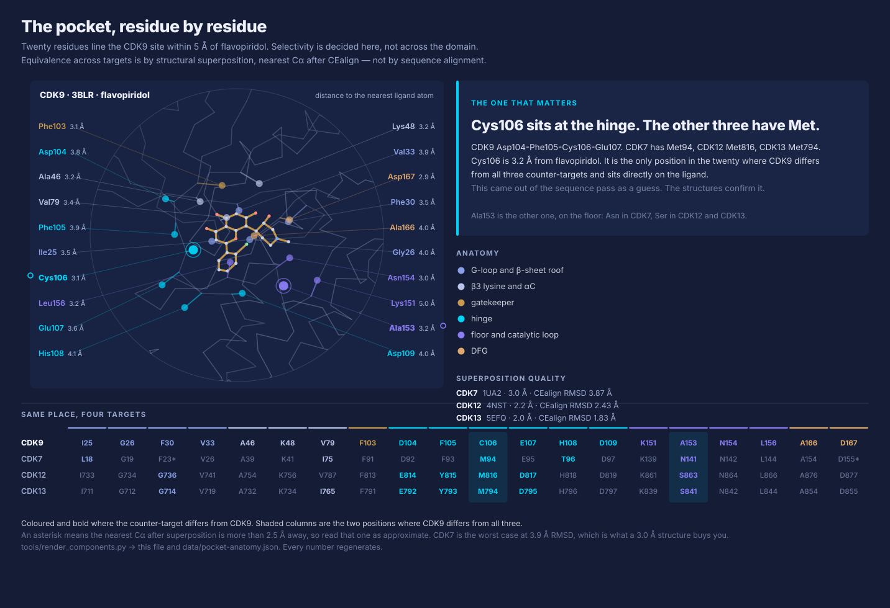

# Molecular visualisation

Two different jobs, and they want different tools.

**Figures in the repo.** Must regenerate from a script. Same discipline as
[`tools/make_figures.py`](../../tools/make_figures.py): pinned inputs, committed source, no
hand-posed screenshots. If a figure can't be regenerated it can't be trusted after the third
revision.

**Updates to the community.** Should be interactive and open in a browser with no install. A still
image of a pocket is much less useful than one someone can rotate.

---

## The options

| Tool | Licence | Scripting | Headless | Apple Silicon / arm64 | Best at |
| --- | --- | --- | --- | --- | --- |
| **VMD** | Free, non-commercial, registration. Not open source | Tcl, Python | `vmd -dispdev text -e s.tcl` | ⚠️ no official arm64 build. Check before relying on it | MD trajectories, big systems, the MD community standard |
| **ChimeraX** | Free academic | `.cxc` command files, Python | `chimerax --nogui --script` | ✅ native | Publication figures, one binary, modern renderer |
| **PyMOL** | Commercial + open-source fork | `.pml`, Python API | `pymol -cq s.pml` | ✅ | Ubiquitous in structural biology, everyone can read a `.pml` |
| **Mol\*** | MIT | TypeScript / JS | n/a, web | n/a | Embedding a full viewer in a page. Powers the RCSB site |
| **3Dmol.js / py3Dmol** | BSD | JS, Python | n/a, web | n/a | Dropping a rotatable structure into a page or notebook in ten lines |
| **NGL / nglview** | MIT | JS, Python | n/a, web | n/a | Same niche as 3Dmol, stronger in Jupyter |
| **MDAnalysis / MDTraj** | GPL / LGPL | Python | ✅ | ✅ | The quantitative plots: RMSD, RMSF, contact maps |
| **ProLIF** | MIT | Python | ✅ | ✅ | Protein-ligand interaction fingerprints, feeds our contact-persistence metric |

## What we're using, and why

**ChimeraX for repo figures.** One binary, native on Apple Silicon, `--nogui` works cleanly, and
`.cxc` files are short enough to read in a diff. Scripts live in
[`tools/render/`](../../tools/render/).

**3Dmol.js for anything community-facing.** Sixty lines of HTML, no build step, works on a phone.
[`tools/render/viewer.html`](../../tools/render/viewer.html) is a working example loading CDK9 and
CDK7 side by side.

**VMD for WP-C's trajectory work**, if the team already knows it. It's the MD standard and there's
no reason to fight that. Two caveats worth checking early:

- **No official arm64 build.** On the GB10 boxes, VMD is probably not an option
  ([the same architecture split as everything else](../06-feasibility/compute-plan.md#the-architecture-split)).
  Plan on VMD living on x86_64 machines, and don't let a figure pipeline depend on it
- VMD 2 is in development. The Tcl interface is stable, Python support is described as improving in
  the final 2.0 release. Pin whichever version you use

**ProLIF plus MDAnalysis for the analysis plots.** The contact-persistence and RMSF numbers in
[metrics.md](../04-experiments/metrics.md) come out of these, not out of a renderer.

## The rule

Every structural figure committed here carries, in the script:

- the **PDB ID** and the date fetched
- the **exact command** that produced it
- the **tool and version**

Same as the numbers carrying provenance tags. A pocket render with no PDB ID behind it is decoration.

## Structures we're using

Verified against the RCSB API on 2026-09-19.

| PDB | Å | What |
| --- | --- | --- |
| **3BLR** | 2.8 | Human CDK9 / cyclin T1 with flavopiridol. Our primary CDK9 holo structure |
| 3BLQ | 2.9 | Human CDK9 / cyclin T1 with ATP |
| 4BCG | 3.1 | CDK9 / cyclin T with a 2-amino-4-heteroaryl inhibitor |
| **1UA2** | 3.0 | Human CDK7 with ATP. Counter-target. Three copies in the asymmetric unit |
| **4NST** | 2.2 | CDK12 / cyclin K with ADP-AlF. Counter-target |
| **5EFQ** | 2.0 | CDK13 / cyclin K with ADP-AlF. Counter-target |
| 5HBE | 2.4 | CDK8 / cyclin C. The harder pair |
| 9H8S | 2.2 | CDK8 / cyclin C with an inhibitor |
| 6XBZ | 2.8 | The CDK-activating kinase, containing CDK7 |

All four targets have structures, which was not guaranteed. CDK12 and CDK13 at 2.2 and 2.0 Å are
better than CDK9's own 2.8 Å.

WP-A owns the final selection and the cleaning protocol
([S0](stages/S0-benchmark.md), [C5](../02-scope/open-questions.md)). Note the resolutions: 2.8 to
3.1 Å is modest, which matters when we compare a predicted pose against one of these and call the
difference an error.

## The structures

[`tools/render_structures.py`](../../tools/render_structures.py) fetches the entries, superposes
them onto CDK9 with CEalign, and draws a depth-cued Cα trace straight to SVG. No renderer needed,
runs anywhere Python does including the GB10 boxes, and the output is text so it diffs.

It is a schematic. For publication figures use [`tools/render/pocket.cxc`](../../tools/render/pocket.cxc).

Two things the script has to get right, and both caught real problems on the first pass:

- **Modified residues are not ligands.** TPO, the activation-loop phosphothreonine, is part of the
  chain. Drawn as a ligand it looks like a second binding event. It's marked with an open circle
  instead
- **Entries hold several copies.** Without a proximity filter, a neighbouring copy's ADP floats in
  the panel looking meaningful. Ligands are filtered to within 10 Å of the chain being drawn

## Zooming in

A whole-protein picture is the least informative view we have, because no stage operates on a
whole protein. Each one works at its own scale.

Same structure, same camera, same centre. Only the radius changes. Bright is kept, dim is
discarded, and the heavy-atom count under each panel is the cost driver for the stage named in its
corner. The counts are `[measured]`; the cost multipliers are a cubic scaling and are `[estimate]`.

Then the scale below that, where the selectivity question is actually settled:

**This one supersedes the caveat on the protein-space figure.** Equivalence across targets is by
CEalign superposition and nearest Cα, not by sequence alignment. It confirms what the sequence pass
guessed: CDK9 carries **Cys106** at the hinge where CDK7, CDK12 and CDK13 all carry methionine, and
it sits 3.2 Å from flavopiridol. Read the asterisks — CDK7 superposes at 3.87 Å RMSD, so a handful
of its assignments are approximate.

Both come from [`tools/render_components.py`](../../tools/render_components.py), with every number
written to [`data/pocket-anatomy.json`](../../data/pocket-anatomy.json) so the tables in
[S2](stages/S2-pocket-extraction.md) and [S6](stages/S6-quantum-labelling.md) can be checked
without rerunning anything.

## The protein space

Before any rendering, the sequence-level picture is worth having:

Generated by [`tools/fetch_protein_space.py`](../../tools/fetch_protein_space.py) into
[`data/protein-space.json`](../../data/protein-space.json), so the figure regenerates offline and
the numbers can be checked.

Two things fall out of it.

**The pocket is much more conserved than the domain.** CDK9 against its counter-targets is 44 to
50% identical over the kinase region, but 67 to 72% across the 18 ATP-site positions. Whole-domain
identity understates the problem.

**CDK8 and CDK19 are identical at all 18 positions.** CDK4 and CDK6 sit at 94%. Both are harder
than our pair, and both are in the same family, which makes them the obvious scale-up targets once
the chain holds on ours.

One caveat on the figure: site positions are mapped from CDK2 by sequence alignment, not structural
superposition. Good enough to orient, not good enough to build on. Once we have the structures
loaded, redo it properly.
