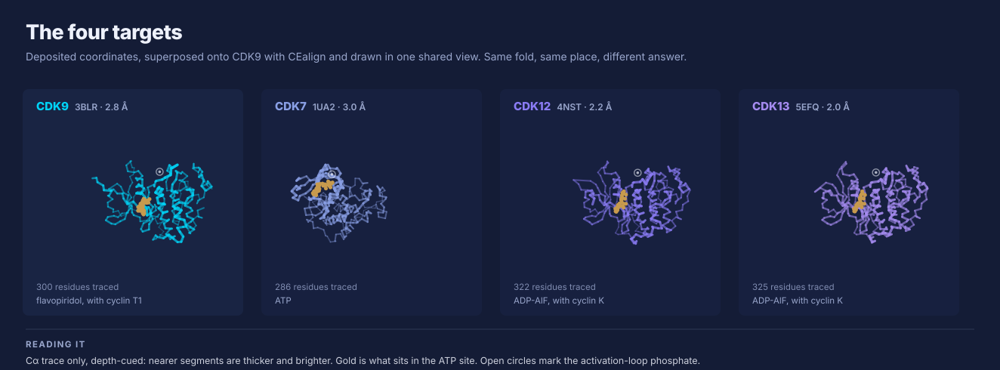
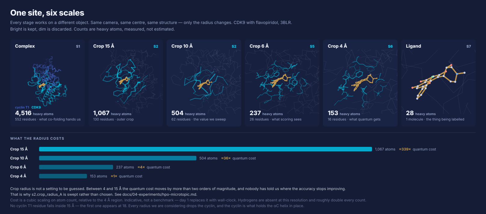

# The worked example

A CDK selectivity problem, already set up. Take it if you'd rather start with something than spend
the morning sourcing data, or bring your own.

## The problem

CDK9 is a drug target. CDK7, CDK12 and CDK13 are close relatives you would rather not hit. All four
have deposited structures, and the ATP sites are similar enough that telling them apart is a real
question rather than an exercise.

| | PDB | Resolution |
| --- | --- | --- |
| CDK9 | 3BLR | 2.8 Å |
| CDK7 | 1UA2 | 3.0 Å |
| CDK12 | 4NST | 2.2 Å |
| CDK13 | 5EFQ | 2.0 Å |



## What makes it interesting

Sequence identity across the whole kinase region is 44–50%. Across the eighteen ATP-site positions
it rises to 67–72% `[measured]`. The pocket is the conserved part, which is also the part that has to
be told apart.

At residue resolution it comes down to very little. Twenty residues line the CDK9 site within 5 Å of
flavopiridol. Two of those twenty are positions where CDK9 differs from all three counter-targets,
and one of them — Cys106 at the hinge, 3.2 Å from the ligand — is where the others carry methionine.


Equivalence across targets is by structural superposition, nearest Cα after CEalign.

## Scale changes what you're looking at



Same structure, same camera, only the radius changes. The heavy-atom count under each panel is what
that scale costs. Between a 4 Å region and a 15 Å crop the count goes from 153 to 1,067, which on a
cubic scaling is a factor of a few hundred in quantum cost `[estimate]`.

One thing that fell out of measuring it: no cyclin T1 residue lies within 15 Å of the ligand, so a
crop at any of the usual radii drops the cyclin. The cyclin is what holds the αC helix in the active
position, so it's worth knowing before you build on a cropped pocket.

## Regenerate any of it

Everything here comes from deposited coordinates through a script. Needs biopython and numpy, and
network access the first time.

```bash
python3 tools/render_structures.py    # the four backbones, superposed
python3 tools/render_components.py    # the pocket and the scale ladder
python3 tools/fetch_protein_space.py  # the sequence identity numbers
```

Numbers land in [`data/pocket-anatomy.json`](../data/pocket-anatomy.json) and
[`data/protein-space.json`](../data/protein-space.json) so they can be checked without rerunning
anything.

## Rotating it

[`tools/render/viewer.html`](../tools/render/viewer.html) opens all four structures in a browser
with no install, plus a superposed view and a crop-radius button. GitHub can't run JavaScript inline,
so the figures above are the static version. There are also ChimeraX, PyMOL and VMD scripts in
[`tools/render/`](../tools/render/) if you'd rather use a real renderer.

## Beyond these four

CDK8 and CDK19 are identical at all eighteen ATP-site positions `[measured]`. If the four above turn
out to be easy, that pair is waiting.
